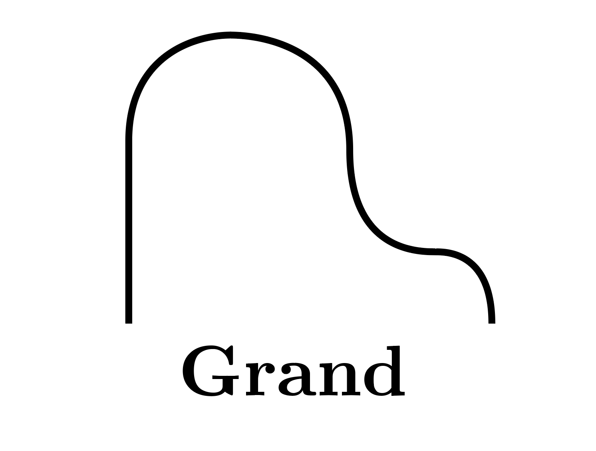

<div align=center></div>

<div align=center><a href="https://pypi.org/project/grand-graph/"></a> <a href="https://app.codecov.io/gh/aplbrain/grand"></a></div>

<!--  <a href="https://github.com/aplbrain/grand/actions/workflows/python-package.yml"></a> -->

<br />

<p align=center>Graph toolkit interoperability and scalability for Python</p>

## Installation

```shell
pip install grand-graph
```

## Example use-cases

-   Write NetworkX commands to analyze true-serverless graph databases using DynamoDB\*
-   Query a host graph in SQL for subgraph isomorphisms with DotMotif
-   Write iGraph code to construct a graph, and then play with it in Networkit
-   Attach node and edge attributes to Networkit or IGraph graphs

> \* [Neptune is not true-serverless.](docs/What-About-Neptune.md)

## Why it's a big deal

_Grand_ is a Rosetta Stone of graph technologies. A _Grand_ graph has a "Backend," which handles the implementation-details of talking to data on disk (or in the cloud), and an "Dialect", which is your preferred way of talking to a graph.

For example, here's how you make a graph that is persisted in DynamoDB (the "Backend") but that you can talk to as though it's a `networkx.DiGraph` (the "Dialect"):

```python
import grand

G = grand.Graph(backend=grand.DynamoDBBackend())

G.nx.add_node("Jordan", type="Person")
G.nx.add_node("DotMotif", type="Project")

G.nx.add_edge("Jordan", "DotMotif", type="Created")

assert len(G.nx.edges()) == 1
assert len(G.nx.nodes()) == 2
```

It doesn't stop there. If you like the way IGraph handles anonymous node insertion (ugh) but you want to handle the graph using regular NetworkX syntax, use a `IGraphDialect` and then switch to a `NetworkXDialect` halfway through:

```python
import grand

G = grand.Graph()

# Start in igraph:
G.igraph.add_vertices(5)

# A little bit of networkit:
G.networkit.addNode()

# And switch to networkx:
assert len(G.nx.nodes()) == 6

# And back to igraph!
assert len(G.igraph.vs) == 6
```

You should be able to use the "dialect" objects the same way you'd use a real graph from the constituent libraries. For example, here is a NetworkX algorithm running on NetworkX graphs alongside Grand graphs:

```python
import networkx as nx

nx.algorithms.isomorphism.GraphMatcher(networkxGraph, grandGraph.nx)
```

Here is an example of using Networkit, a highly performant graph library, and attaching node/edge attributes, which are not supported by the library by default:

```python
import grand
from grand.backends.networkit import NetworkitBackend

G = grand.Graph(backend=NetworkitBackend())

G.nx.add_node("Jordan", type="Person")
G.nx.add_node("Grand", type="Software")
G.nx.add_edge("Jordan", "Grand", weight=1)

print(G.nx.edges(data=True)) # contains attributes, even though graph is stored in networkit
```

## Current Support

<table><tr>
<th>✅ = Fully Implemented</th>
<th>🤔 = In Progress</th>
<th>🔴 = Unsupported</th>
</tr></table>

| Dialect            | Description & Notes      | Status |
| ------------------ | ------------------------ | ------ |
| `IGraphDialect`    | Python-IGraph interface  | ✅     |
| `NetworkXDialect`  | NetworkX-like interface  | ✅     |
| `NetworkitDialect` | Networkit-like interface | ✅     |

| Backend            | Description & Notes          | Status |
| ------------------ | ---------------------------- | ------ |
| `DataFrameBackend` | Stored in pandas-like tables | ✅     |
| `DynamoDBBackend`  | Edge/node tables in DynamoDB | ✅     |
| `GremlinBackend`   | For Gremlin datastores       | ✅     |
| `IGraphBackend`    | An IGraph graph, in memory   | ✅     |
| `NetworkitBackend` | A Networkit graph, in memory | ✅     |
| `NetworkXBackend`  | A NetworkX graph, in memory  | ✅     |
| `SQLBackend`       | Two SQL-queryable tables     | ✅     |

You can read more about usage and learn about backends and dialects in [the wiki](https://github.com/aplbrain/grand/wiki).

## Citing

If this tool is helpful to your research, please consider citing it with:

```bibtex
# https://doi.org/10.1038/s41598-021-91025-5
@article{Matelsky_Motifs_2021,
    title={{DotMotif: an open-source tool for connectome subgraph isomorphism search and graph queries}},
    volume={11},
    ISSN={2045-2322},
    url={http://dx.doi.org/10.1038/s41598-021-91025-5},
    DOI={10.1038/s41598-021-91025-5},
    number={1},
    journal={Scientific Reports},
    publisher={Springer Science and Business Media LLC},
    author={Matelsky, Jordan K. and Reilly, Elizabeth P. and Johnson, Erik C. and Stiso, Jennifer and Bassett, Danielle S. and Wester, Brock A. and Gray-Roncal, William},
    year={2021},
    month={Jun}
}
```

---

<p align=center><b>Made with 💙 at <a href="https://jhuapl.edu"></a></b></p>
